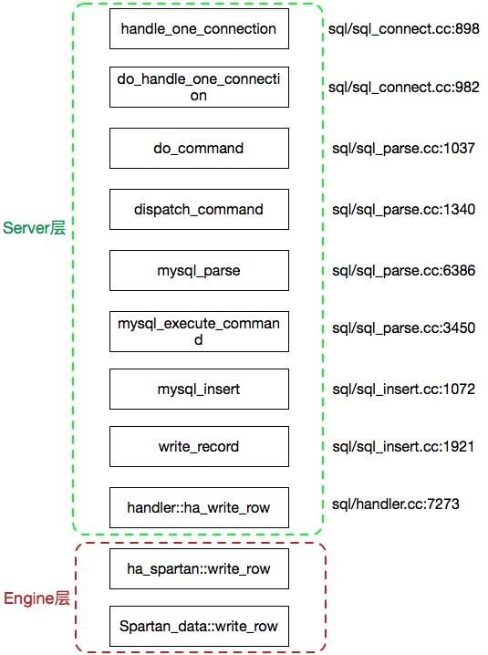

## 1.添加Spartan引擎 

### 添加spartan_data以及spartan_index

在storage/spartan目录创建

```
spartan_data.cc
spartan_data.h
spartan_index.cc
spartan_index.h
```

### 编译修改
- 拷贝example目录修改为spartan,并将含example关键字修改为spartan
- 修改CMakeLists.txt,添加spartan_data.cc
- 将spartan_data.h添加到ha_spartan.h中
- 重新make && make install

### 将spartan添加到server中

#### 使用插件方式
```
INSTALL PLUGIN spartan SONAME 'ha_spartan.so';

mysql> show plugins;
+------------+--------+----------------+---------------+---------+
| Name       | Status | Type           | Library       | License |
+------------+--------+----------------+---------------+---------+
| binlog     | ACTIVE | STORAGE ENGINE | NULL          | GPL     |
| ARCHIVE    | ACTIVE | STORAGE ENGINE | NULL          | GPL     |
| BLACKHOLE  | ACTIVE | STORAGE ENGINE | NULL          | GPL     |
| CSV        | ACTIVE | STORAGE ENGINE | NULL          | GPL     |
| MEMORY     | ACTIVE | STORAGE ENGINE | NULL          | GPL     |
| InnoDB     | ACTIVE | STORAGE ENGINE | NULL          | GPL     |
| MyISAM     | ACTIVE | STORAGE ENGINE | NULL          | GPL     |
| MRG_MYISAM | ACTIVE | STORAGE ENGINE | NULL          | GPL     |
| EXAMPLE    | ACTIVE | STORAGE ENGINE | ha_example.so | GPL     |
| SPARTAN    | ACTIVE | STORAGE ENGINE | ha_spartan.so | GPL     |
+------------+--------+----------------+---------------+---------+
10 rows in set (0.00 sec)
```

#### 将spartan引擎添加到server中

修改my_config.h,添加如下内容:
 
```c
/*BEGIN GUOSONG MODIFICATION*/
#define WITH_SPARTAN_STORAGE_ENGINE 1
/*END GUOSONG MODIFICATION*/

```

修改handler.h,添加如下内容:

```c
enum legacy_db_type
{
    ...
  DB_TYPE_SPARTAN_DB,
  DB_TYPE_FIRST_DYNAMIC=42,
  DB_TYPE_DEFAULT=127 // Must be last
    ...
}
```

## 2.创建Spartan引擎表

### 2.1 更新ha_spartan.h头文件

```c
#include "spartan_data.h"

class Spartan_share : public Handler_share {
public:
  mysql_mutex_t mutex;
  THR_LOCK lock;
  Spartan_share();
  ~Spartan_share()
  {
    /*BEGIN GUOSONG MODIFICATION*/
    if(data_class != NULL)
      delete data_class;
    data_class = NULL;
    /*END GUOSONG MODIFICATION*/
    thr_lock_delete(&lock);
    mysql_mutex_destroy(&mutex);
  }
  /*BEGIN GUOSONG MODIFICATION*/
  Spartan_data *data_class;
  /*END GUOSONG MODIFICATION*/ 
};
```

### 2.2 更新ha_spartan.cc类文件

```c
Spartan_share::Spartan_share()
{
  thr_lock_init(&lock);       
  mysql_mutex_init(ex_key_mutex_Spartan_share_mutex,
    ¦   ¦   ¦   ¦  &mutex, MY_MUTEX_INIT_FAST);
  /*BEGIN GUOSONG MODIFICATION*/ 
  data_class = new Spartan_data();
  /*END GUOSONG MODIFICATION*/
}
```

### 2.3 更新文件后缀扩展

```c
/*BEGIN GUOSONG MODIFICATION*/
#define SDE_EXT ".sde"
#define SDI_EXT ".sdi"
/*END GUOSONG MODIFICATION*/

static const char *ha_spartan_exts[] = {
/*BEGIN GUOSONG MODIFICATION*/
  SDE_EXT,
  SDI_EXT,
/*END GUOSONG MODIFICATION*/

  NullS
};
```

### 2.4 修改ha_spartan.cc中create函数

```c
int ha_spartan::create(const char *name, TABLE *table_arg,
    ¦   ¦   ¦   ¦   ¦  HA_CREATE_INFO *create_info)
{
  DBUG_ENTER("ha_spartan::create");
  /*
    This is not implemented but we want someone to be able to see that it
    works.
  */
  /*BEGIN GUOSONG MODIFICATION*/
  char name_buff[FN_REFLEN];

  if(!(share = get_share()))
    ¦ DBUG_RETURN(1);

  if(share->data_class->create_table(fn_format(name_buff, name, "",SDE_EXT,
    ¦   ¦   ¦   ¦ MY_REPLACE_EXT|MY_UNPACK_FILENAME)))
    ¦   DBUG_RETURN(-1);
  share->data_class->close_table();
  /*END GUOSONG MODIFICATION*/
  DBUG_RETURN(0);
}
```

### 2.5 修改ha_spartan.cc中open函数

```c
int ha_spartan::open(const char *name, int mode, uint test_if_locked)
{
  DBUG_ENTER("ha_spartan::open");
  /*BEGIN GUOSONG MODIFICATION*/
  Spartan_share *share;
  char name_buff[FN_REFLEN];
  if (!(share = get_share()))
    DBUG_RETURN(1);
  share->data_class->open_table(fn_format(name_buff, name, "", SDE_EXT,
              MY_REPLACE_EXT|MY_UNPACK_FILENAME));

  /*if (!(share = get_share()))
    DBUG_RETURN(1);*/
  /*END GUOSONG MODIFICATION*/

  thr_lock_data_init(&share->lock,&lock,NULL);

  DBUG_RETURN(0);
}

```

### 2.6 修改ha_spartan.cc中delete_table函数

```c
int ha_spartan::delete_table(const char *name)
{
  DBUG_ENTER("ha_spartan::delete_table");
  /* This is not implemented but we want someone to be able that it works. */
  /*BEGIN GUOSONG MODIFICATION*/
  char name_buff[FN_REFLEN];
  my_delete(fn_format(name_buff, name, "",
          SDE_EXT,MY_REPLACE_EXT|MY_UNPACK_FILENAME), MYF(0));
  /*END GUOSONG MODIFICATION*/
  DBUG_RETURN(0);
}
```

### 2.7 修改ha_spartan.cc中rename_table

```c
int ha_spartan::rename_table(const char * from, const char * to)
{
  /*BEGIN GUOSONG MODIFICATION*/
  char data_from[FN_REFLEN];
  char data_to[FN_REFLEN];
  int i = 0;

  DBUG_ENTER("ha_spartan::rename_table ");
  /*i = my_copy(fn_format(data_from, from, "", SDE_EXT,
          MY_REPLACE_EXT|MY_UNPACK_FILENAME),
          fn_format(data_to, to,"",SDE_EXT,
          MY_REPLACE_EXT|MY_UNPACK_FILENAME), MYF(0));*/
  my_delete(data_from, MYF(0));
  DBUG_RETURN(i);
  /*DBUG_RETURN(HA_ERR_WRONG_COMMAND);*/
}
```

### 2.8 测试

```sql
mysql> show create table t1\G
*************************** 1. row ***************************
       Table: t1
Create Table: CREATE TABLE `t1` (
  `a` int(11) DEFAULT NULL
) ENGINE=spartan DEFAULT CHARSET=utf8

mysql> system ls -lh ./data/test/t1.*
-rw-rw---- 1 my5627 mysql  8.4K May  8 16:37 ./data/test/t1.frm
-rw-rw---- 1 my5627 my5627    0 May  8 17:10 ./data/test/t1.sde
```

## 3 支持insert操作

### 3.0 insert操作流程



### 3.1 增加data_file对应的pos变量

```c
class ha_spartan: public handler
{
  THR_LOCK_DATA lock;      ///< MySQL lock
  Spartan_share *share;    ///< Shared lock info
  Spartan_share *get_share(); ///< Get the share
/*BEGIN GUOSONG MODIFICATION*/
/*data文件scan的时候文件fd当前位置pos*/
  off_t current_position;
/*END GUOSONG MODIFICATION*/
...
}
```

### 3.2 在ha_spartan.cc中修改rnd_init函数

```c
int ha_spartan::rnd_init(bool scan)
{
  DBUG_ENTER("ha_spartan::rnd_init");
  /*START GUOSONG MODIFICATION*/
  current_position = 0;
  stats.records = 0;
  ref_length = sizeof(long long);
  /*END GUOSONG MODIFICATION*/
  DBUG_RETURN(0);
}
```
进行table scan的时候一定出现设置.

### 3.3 在ha_spartan.cc中修改rnd_next函数

遍历每个行的时候会访问.
从数据文件中获取每一行数据,并检测是否到文件尾部.


```c
int ha_spartan::rnd_next(uchar *buf)
{
  int rc;
  DBUG_ENTER("ha_spartan::rnd_next");
  MYSQL_READ_ROW_START(table_share->db.str, table_share->table_name.str,
                       TRUE);
  /*BEGIN GUOSONG MODIFICATION*/
  rc = share->data_class->read_row(buf, table->s->rec_buff_length, 
                                    current_position);
  if (rc != -1)
    current_position = (off_t)share->data_class->cur_position();
  else
    DBUG_RETURN(HA_ERR_END_OF_FILE);
  stats.records++;
  /*END GUOSONG MODIFICATION*/
  /*rc= HA_ERR_END_OF_FILE;*/
  MYSQL_READ_ROW_DONE(rc);
  DBUG_RETURN(rc);
}
```

### 3.4更新position位置信息

```c

void ha_spartan::position(const uchar *record)
{
  DBUG_ENTER("ha_spartan::position");
  /*BEGIN GUOSONG MODIFICATION*/
  my_store_ptr(ref, ref_length, current_position);
  /*END GUOSONG MODIFICATION*/
  DBUG_VOID_RETURN;
}
```

### 3.5 保存当前pos,并读取其下一行

```c
int ha_spartan::rnd_pos(uchar *buf, uchar *pos)
{
  int rc;
  DBUG_ENTER("ha_spartan::rnd_pos");
  MYSQL_READ_ROW_START(table_share->db.str, table_share->table_name.str,
                       TRUE);
  ha_statistic_increment(&SSV::ha_read_rnd_next_count);
  current_position = (off_t)my_get_ptr(pos, ref_length);
  rc = share->data_class->read_row(buf, current_position, -1);
  /*rc= HA_ERR_WRONG_COMMAND;*/
  MYSQL_READ_ROW_DONE(rc);
  DBUG_RETURN(rc);
}
```

### 3.6 修改ha_spartan.cc中的info函数

```c
int ha_spartan::info(uint flag)
{
  DBUG_ENTER("ha_spartan::info");
  if(stats.records<2)
    stats.records = 2;
  DBUG_RETURN(0);
}
```

### 3.7 修改ha_spartan::write_row实现真正文件的操作

```c
int ha_spartan::write_row(uchar *buf)
{
  DBUG_ENTER("ha_spartan::write_row");
  /*
    spartan of a successful write_row. We don't store the data
    anywhere; they are thrown away. A real implementation will
    probably need to do something with 'buf'. We report a success
    here, to pretend that the insert was successful.
  */
  long long pos;
  ha_statistic_increment(&SSV::ha_write_count);
  mysql_mutex_lock(&share->mutex);
  pos = share->data_class->write_row(buf, table->s->rec_buff_length);
  mysql_mutex_unlock(&share->mutex);
  DBUG_RETURN(0);
}
```

### 3.8 测试

```sql
mysql> show create table t\G
*************************** 1. row ***************************
       Table: t
Create Table: CREATE TABLE `t` (
  `col_a` int(11) DEFAULT NULL,
  `col_b` varchar(10) NOT NULL DEFAULT ' '
) ENGINE=spartan DEFAULT CHARSET=utf8
1 row in set (0.00 sec)

mysql> insert into t values(1, "test1");
Query OK, 1 row affected (0.02 sec)

mysql> insert into t values(1, "test2");
Query OK, 1 row affected (0.00 sec)

mysql> insert into t values(2, "test2"); 
Query OK, 1 row affected (0.01 sec)

mysql> insert into t values(4, "test4");
Query OK, 1 row affected (0.01 sec)

mysql> select * from t;
+-------+-------+
| col_a | col_b |
+-------+-------+
|     1 | test1 |
|     1 | test2 |
|     2 | test2 |
|     4 | test4 |
+-------+-------+
4 rows in set (0.00 sec)
```

### 3.9 增加update|delete|truncate操作

#### update

```c
int ha_spartan::update_row(const uchar *old_data, uchar *new_data)
{

  DBUG_ENTER("ha_spartan::update_row");
  mysql_mutex_lock(&share->mutex);
  share->data_class->update_row((uchar*)old_data, new_data,
        table->s->rec_buff_length, current_position - 
        share->data_class->row_size(table->s->rec_buff_length));
  mysql_mutex_unlock(&share->mutex);
  DBUG_RETURN(0);
}
```

#### delete

```c
int ha_spartan::delete_row(const uchar *buf)
{
  DBUG_ENTER("ha_spartan::delete_row");
  mysql_mutex_lock(&share->mutex);
  share->data_class->delete_row((uchar*)buf,
          table->s->rec_buff_length,
          current_position - 
          share->data_class->row_size(table->s->rec_buff_length));
  mysql_mutex_unlock(&share->mutex);
  DBUG_RETURN(0);
}
```

#### delete_all_rows

```c
int ha_spartan::delete_all_rows()
{
  DBUG_ENTER("ha_spartan::delete_all_rows");
  mysql_mutex_lock(&share->mutex);
  share->data_class->trunc_table();
  mysql_mutex_unlock(&share->mutex);
  DBUG_RETURN(0);
}
```

#### truncate

```c
int ha_spartan::truncate()
{
  DBUG_ENTER("ha_spartan::truncate");
  mysql_mutex_lock(&share->mutex);
  share->data_class->trunc_table();
  mysql_mutex_unlock(&share->mutex);
  DBUG_RETURN(0);
}
```
